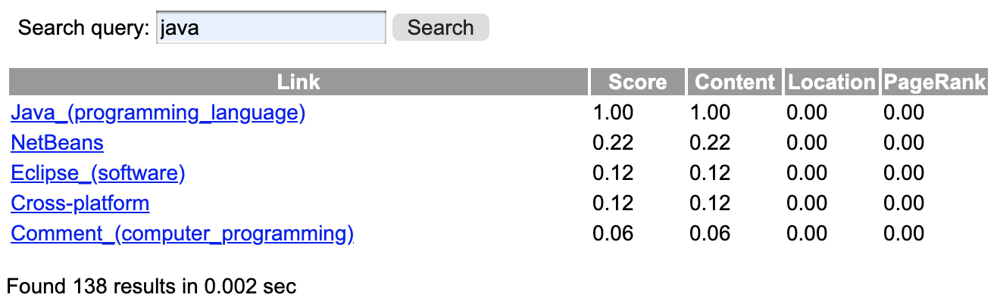
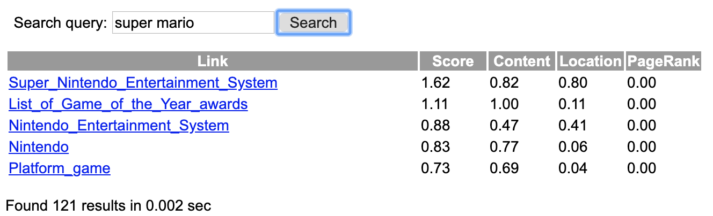
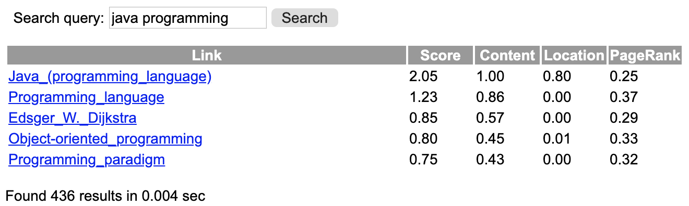

# A3 - Search Engine

## Description

* In this assignment, you shall implement a basic search engine for Wikipedia articles.
* You can use any programming language you like.
* You shall present your application and code at an oral examination.

## Submission instructions

See the [Deadlines and Submissions](https://coursepress.lnu.se/courses/web-intelligence/study-guide/deadlines-and-submissions) page.

## Requirements

<table>
  <tr>
    <th>Grade</th>
    <th>Requirements</th>
  </tr>
  <tr>
    <td>E</td>
    <td>
      <ul>
        <li>Implement a basic search engine that index all pages in the <em>Wikipedia</em> dataset (see <a href="https://coursepress.lnu.se/courses/web-intelligence/assignments/datasets">Datasets</a> page).</li>
        <li>Search queries shall only contain single words.</li>
        <li>Results shall be ranked using the word frequency metric.</li>
        <li>The user shall input the search queries in a web client, and display the search results returned from the server.</li>
        <li>Display the top 5 search results with page and rank score.</li>
        <li>Implement the system using a REST web service where:
          <ol>
            <li>client sends a request to a server.</li>
            <li>the server responds with <em>JSON</em> data.</li>
            <li>the <em>json</em> data is decoded and presented in a client GUI.</li>
          </ol>
        </li>
      </ul>
    </td>
  </tr>
  <tr>
    <td>C-D</td>
    <td>
    <ul>
      <li>It shall be possible to use search queries of more than one word.</li>
      <li>Results shall be ranked using: <code>score = word_frequency + 0.8 * document_location</code></li>
      <li>Display the top five search results with page and rank score.</li>
      </ul>
    </td>
  </tr>
  <tr>
    <td>A-B</td>
    <td>
      <ul>
        <li>Implement the PageRank algorithm and use it to rank the search results.</li>
        <li>Run the algorithm for 20 iterations.</li>
        <li>Results shall be ranked using: <code>score = word_frequency + 0.8 * document_location + 0.5 * pagerank</code></li>
        <li>Display the top five search results with page and rank score.</li>
      </ul>
    </td>
  </tr>
</table>

> Note that the dataset has been updated, so the last part of the recording results is inaccurate. The slides PDF has been updated to the new dataset.

## Test cases

Here are some test cases you can use to verify that your search engine works correctly.

### Grade E

### Grade C-D

### Grade A-B

> Note that updating PageRanks can be very slow if implemented with inefficient data structures. As a comparison, my Python implementation takes around four seconds to update PageRanks. It is okay if your PageRank scores differ slightly, ±0.02, compared to the test cases.
